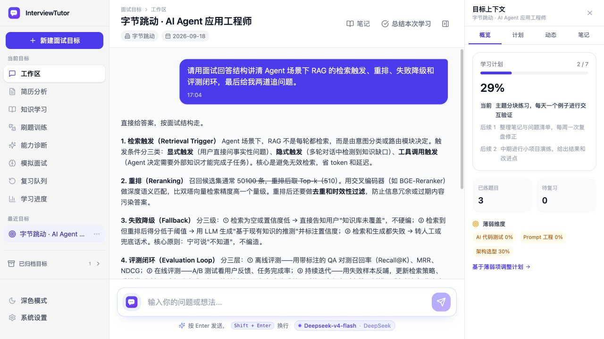
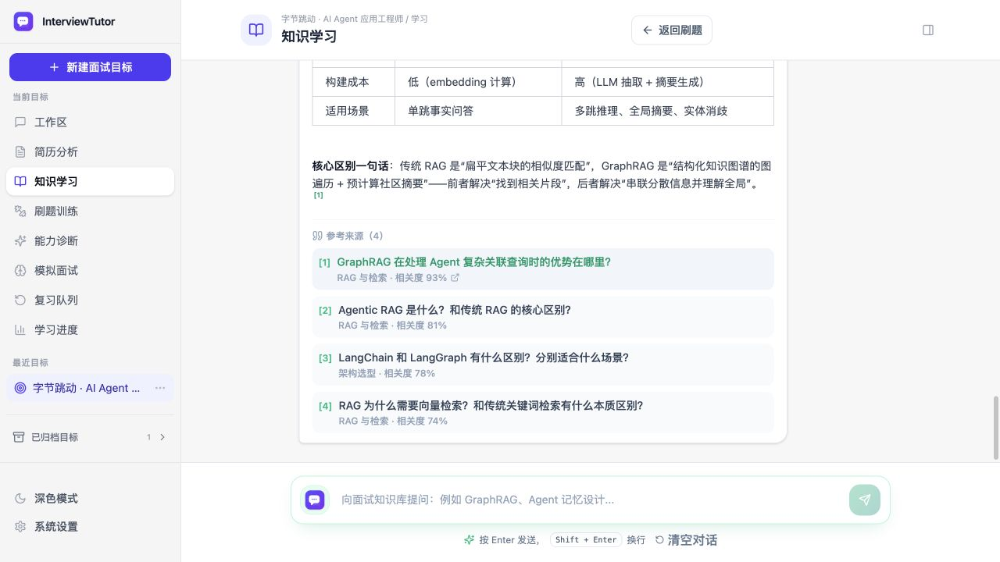
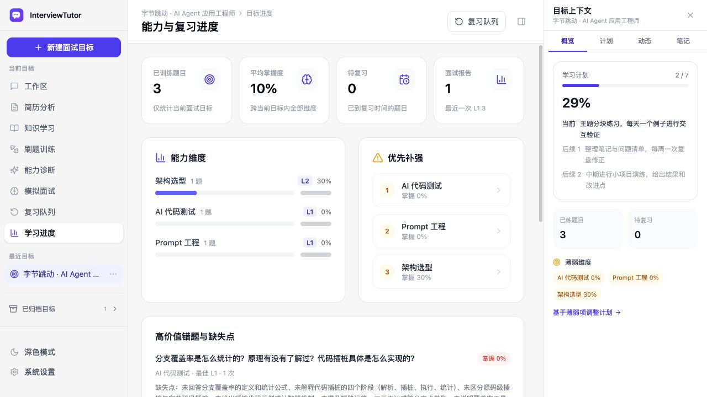

  
  <h1>InterviewTutor</h1>
  
<strong>面向 AI Agent / LLM 应用工程岗位的目标驱动型面试训练工作台</strong>

  
把岗位目标、简历、知识学习、刷题、模拟面试和复习计划收束到同一个本地工作区。

  <a href="#项目简介"><strong>项目简介</strong></a>
  ·
  <a href="#核心技术实现">核心实现</a>
  ·
  <a href="#能力矩阵">能力矩阵</a>
  ·
  <a href="#快速开始">快速开始</a>
  ·
  <a href="#技术栈与代码结构">代码结构</a>

  
  
  
  
  
  
  

## 项目简介

**InterviewTutor** 是一个本地优先的 AI 技术面试训练系统。它不把面试准备拆成互不相关的聊天记录，而是围绕一个明确目标持续积累岗位信息、简历证据、学习计划、训练结果、错题和复习进度。

系统把工作分成两类：LLM 负责理解意图、讲解知识、评审回答和生成追问；确定性代码负责目标状态、训练阶段、评分结构、知识快照、数据持久化和失败降级。简单问答走低延迟快路，计划调整、观点评审或深度追问才进入更完整的 Agent 链路。

项目同时覆盖知识学习和实战训练：一边通过混合 RAG 提供带来源的讲解，另一边通过刷题、诊断、模拟面试和简历拷打形成可重复的训练闭环。随包知识库的实际构建信息记录在 [knowledge_manifest.json](data/knowledge_manifest.json)。

| **592 道题** | **16 个有效维度** | **5 种学习与训练模式** | **2 条独立 RAG 链路** |
| :---: | :---: | :---: | :---: |
| 随包结构化题库 | 覆盖 Agent、RAG、评测与工程化 | 学习 / 刷题 / 诊断 / 模拟 / 复习 | 知识检索 / 对话记忆 |

## 运行效果

  

目标工作区：面试对话、学习计划、训练统计和薄弱维度集中在同一个上下文中。

  

知识学习：混合检索当前题库，流式生成讲解并展示引用来源、所属维度和相关度。

  

学习进度：按当前目标汇总掌握度、优先补强方向、高价值错题与诊断报告。

## 产品闭环

~~~text
创建面试目标
  ├─ 岗位与公司信息 ──▶ 生成学习计划 ──▶ 对话调整
  ├─ 上传简历 ───────▶ 项目深挖 / 岗位匹配 / 简历拷打
  ├─ 知识学习 ───────▶ 题库 RAG ──────▶ 带引用讲解
  └─ 刷题 / 诊断 / 模拟面试
              │
              ▼
        评分 · 弱项 · 错题
              │
              ▼
        复习队列与计划回流
~~~

每个目标拥有独立的会话、计划、训练进度、报告、简历和向量记忆。训练会话还会固定创建时的知识库快照，避免后台更新造成题目与参考答案跨版本混用。

## 系统架构

~~~text
React 18 + Vite 6
        │
        ▼
FastAPI /api/v1
        │
  ┌─────┼───────────┬──────────────┐
  ▼     ▼           ▼              ▼
对话 Agent  面试工作流   简历分析流水线    知识库服务
LangGraph  阶段与评分   抽取/解析/深挖    检索/快照/同步
  │         │           │              │
  └─────────┴───────────┴──────────────┘
                    │
                    ▼
     JSON / Markdown / SQLite / FAISS
~~~

主对话、显式训练状态机、简历分析和知识服务共享同一目标工作区，但各自保留清晰的数据边界。模型层支持 OpenAI Compatible、OpenAI Responses 和 Anthropic Messages 协议。

## 核心技术实现

### 1. 目标感知 Agent：三条执行路径

主对话图定义在 <code>app/core/agent_builder.py</code>。Analyzer 生成结构化 <code>ExecutionPlan</code>，再根据当前目标、会话状态和请求类型选择计划状态机、Direct Tutor 或多 Worker 链路。

~~~text
用户请求
   │
   ▼
[Session + Context]
   │
   ▼
[Analyzer] 生成 ExecutionPlan
   │
   ├── 计划对话 ──▶ [Plan 状态机] ───────────────────┐
   ├── 简单答疑 ──▶ [Direct Tutor] ──────────────────┤
   └── 复杂任务 ──▶ [Tutor + Judge（按需并行）]      │
                            │                         │
                            ▼                         │
                     [Inquiry（按需）]                │
                            │                         │
                            ▼                         │
                       [Aggregator] ──────────────────┘
                                             │
                                             ▼
                                          保存回复
                                             ├──▶ 返回响应
                                             └──▶ 后台维护
                                                  摘要 · FAISS · 学习画像
~~~

计划路径和 Direct Tutor 可以直接产出回复；只有多 Worker 路径需要 Aggregator 融合结果。Tutor 与 Judge 可按需并行，Inquiry 随后读取已有评审生成追问。路由或模型调用超时时，系统会退回安全路径，而不是让一次失败中断整个会话。

### 2. 混合知识库 RAG：关键词与向量互补

知识学习入口位于 <code>app/interview/learn.py</code>，核心检索位于 <code>app/knowledge/retriever.py</code>。中文关键词通道使用 jieba 分词与 SQLite <code>LIKE</code> 计算覆盖率；语义通道使用 Qwen3 Embedding 与题目向量计算相似度。

~~~text
用户问题
   │
   ▼
[当前 KnowledgeSnapshot]
   │
   ├── 关键词检索
   └── 向量检索
   │
   ▼
合并去重 → 阈值过滤 → Top 4
   │
   ▼
题目 + 专家答案 + 差距分析 + 来源
   │
   ▼
[Tutor] 流式生成 ──▶ 回答 + 引用 + snapshot_id
~~~

两路结果合并时以语义命中为主，并提升双通道同时命中的题目。最终上下文始终从同一快照读取，回答返回题目 ID、来源文件和快照 ID，便于定位证据。

### 3. 对话记忆 RAG：跨会话召回但按目标隔离

题库 RAG 和对话记忆 RAG 共用 Embedding 客户端，但数据库与索引完全分离。可见回复保存后，后台任务抽取问答对并写入当前目标自己的 FAISS；下一轮只召回其他会话中的相关经历。

~~~text
历史问答 ──▶ Embedding ──▶ FAISS（按目标隔离）
                                  ▲
                                  │ 查询
新问题 ──────────────────────────┘
   │
   ▼
相关历史 Top 3
   │
   ▼
长期摘要 + 相关历史 + 最近 12 条消息 ──▶ Agent
~~~

向量查询不可用或没有合格命中时，系统会尝试字符级 Jaccard 召回。最终上下文顺序固定为系统提示词、长期摘要、相关历史和最近消息，减少长会话对当前问题的干扰。

### 4. 显式面试工作流：训练阶段由代码控制

刷题、诊断、模拟面试和复习不依赖模型自由决定流程。<code>app/interview/workflow.py</code> 管理出题、作答、评分、追问、复盘与结束条件，Pydantic 模型约束每个阶段的输入和输出。

| 模式 | 执行方式 | 主要反馈 |
| --- | --- | --- |
| 知识学习 | 按问题与可选维度检索题库 | 流式讲解、题目与来源引用 |
| 刷题训练 | 每次一道题，提交后评分 | L1-L5、覆盖点、缺失点、高手答 |
| 能力诊断 | 固定 3 题并覆盖不同维度 | 逐题简评与最终能力基线 |
| 模拟面试 | 连续 3 / 5 / 8 题 | 中途隐藏详细评分，结束后统一报告 |
| 复习队列 | 优先选择到期且低掌握度题目 | 掌握度更新与下次复习时间 |

评分同时观察正确性、深度、权衡推理、工程证据和表达清晰度。训练结果会回写目标进度、错题、弱项和报告，而不是只停留在当前对话。

### 5. 简历驱动训练：从文件到可追问证据

~~~text
PDF / DOCX / Markdown / TXT
          │
          ▼
文本抽取 → 结构化解析
          │
          ├── 项目与经历深挖题
          ├── 岗位 / 公司匹配
          ├── STAR、指标与措辞建议
          └── 简历拷打会话与现场评分
~~~

简历原文件、结构化结果和拷打记录按目标关联。深挖环节可以连接题库，为项目经历补充架构、RAG、评测和工程化方向的追问，但不会把简历内容写入公共题库。

### 6. 动态知识快照：校验通过后再切换

后台同步不会直接覆盖正在使用的数据库。新版本先进入 staging，完成 Markdown 解析、向量增量构建、SQLite 完整性检查和检索冒烟测试，再通过原子指针切换。

~~~text
检查上游版本
  → 下载并安全解压 Markdown
  → 解析与质量门禁
  → 复用旧向量 + 生成变化向量
  → 构建临时 SQLite
  → quick_check / FTS / 向量 / 检索校验
  → 激活新快照或保留旧版本
~~~

同步失败不会影响当前快照；运行时保留回滚候选，并支持通过 API 手动回退。

## 能力矩阵

| 能力域 | 代表能力 | 关键产物 |
| --- | --- | --- |
| 目标工作区 | 岗位、公司、日期、经验等级、归档与恢复 | 目标档案、计划、时间线 |
| 对话 Agent | 意图路由、快路、多 Worker、流式输出与中断 | 回复、执行事件、调用指标 |
| 题库学习 | 混合检索、知识快照、带引用讲解 | answer、citations、question_ids |
| 面试训练 | 刷题、诊断、模拟面试、复习调度 | 评分、弱项、错题、报告 |
| 简历分析 | 抽取、结构化、深挖、匹配、优化与拷打 | 结构化简历、追问题、改进建议 |
| 长期记忆 | 摘要压缩、跨会话召回、学习画像 | 摘要、FAISS、learner profile |
| 知识维护 | 增量同步、质量门禁、快照与回滚 | SQLite、manifest、release snapshot |
| 多端交付 | Web 开发模式、FastAPI 同源托管、pywebview | Web 工作台、macOS <code>.app</code> |

## 技术栈与代码结构

| 层 | 技术 |
| --- | --- |
| Frontend | React 18、TypeScript、Vite 6、React Router 7、TanStack Query 5、Tailwind CSS 4 |
| Agent Backend | Python、FastAPI、LangGraph、LangChain、Pydantic、NDJSON / SSE |
| LLM Protocols | OpenAI Compatible、OpenAI Responses、Anthropic Messages |
| Retrieval & Memory | SQLite、FTS5、FAISS、jieba、Qwen3 Embedding |
| Resume | pypdf、python-docx、结构化 LLM 解析 |
| Desktop | pywebview、FastAPI 同源静态托管、macOS <code>.app</code> 构建脚本 |
| Testing | pytest、Vitest、Testing Library、TypeScript typecheck |

仅将 Agent 与 RAG 核心模块展开到三级，其余目录保持概览：

~~~text
InterviewTutor/
├── app/                               # Python 后端
│   ├── core/                          # Agent 核心
│   │   ├── agent_builder.py           # LangGraph 节点、路由与聚合
│   │   ├── models.py                  # AgentState / ExecutionPlan
│   │   ├── prompts.py                 # Agent 提示词
│   │   ├── task_plan/                 # 学习计划状态机
│   │   ├── context_rag.py             # 对话上下文与记忆召回
│   │   ├── vector_store.py            # 对话记忆 FAISS
│   │   └── memory.py                  # 会话与目标持久化
│   ├── knowledge/                     # 知识库 RAG
│   │   ├── retriever.py               # 关键词 + 向量混合检索
│   │   ├── repository.py              # SQLite / FTS5 仓储
│   │   ├── indexer.py                 # 题目向量构建
│   │   ├── service.py                 # RAG 服务入口
│   │   ├── snapshot.py                # 知识快照管理
│   │   └── sync.py                    # 增量同步与质量门禁
│   ├── api/                           # FastAPI 路由
│   ├── interview/                     # 面试训练工作流
│   ├── resume/                        # 简历分析
│   └── main.py                        # FastAPI 入口
├── web/                               # React 前端
├── knowledge/                         # 题库 Markdown
├── data/                              # SQLite 与知识索引产物
├── memory/                            # 会话、画像与向量数据
├── scripts/                           # 启动、构建与维护脚本
├── tests/                             # 后端测试
├── assets/                            # 图标资源
├── docs/                              # 设计文档
├── desktop.py                         # 桌面端启动器
├── requirements.txt                   # Python 依赖
├── .env.example                       # 配置示例
├── LICENSE
└── README.md
~~~

## 快速开始

### 环境要求

- Python 3.10+
- Node.js 18+ 与 npm
- 一个 OpenAI Compatible、OpenAI Responses 或 Anthropic 模型服务
- 可选但推荐：OpenAI 兼容的 Embedding 服务
- 构建 macOS 应用包时需要 macOS 11+

### 1. 安装依赖

~~~bash
git clone https://github.com/lihongyuan99/InterviewTutor.git
cd InterviewTutor

python3 -m venv tutor
source tutor/bin/activate
python -m pip install --upgrade pip
python -m pip install -r requirements.txt

npm --prefix web install
~~~

Windows 激活虚拟环境时使用 <code>tutor\Scripts\activate</code>。

### 2. 配置模型

~~~bash
cp .env.example .env
cp web/.env.example web/.env
~~~

最小的 DeepSeek 配置：

~~~ini
DEEPSEEK_API_KEY=sk-your-api-key
MODEL_NAME=deepseek-chat
~~~

启动后也可以在左下角「设置」中管理多个模型服务、协议、模型参数和教学风格。设置保存在 <code>memory/llm_settings.json</code>；读取 API 会对密钥脱敏，但本地文件本身未加密。

语义检索、简历深挖、对话向量记忆和知识同步需要维度匹配的 Embedding 服务：

~~~ini
KNOWLEDGE_EMBEDDING_BASE_URL=http://127.0.0.1:8000/v1
KNOWLEDGE_EMBEDDING_MODEL=Qwen3-Embedding-0.6B-4bit-DWQ
KNOWLEDGE_EMBEDDING_API_KEY=local
KNOWLEDGE_EMBEDDING_DIM=1024
~~~

随包数据库中的向量为 1024 维。更换模型或维度后必须重新构建索引，不能只修改环境变量。

### 3. 启动 Web 开发模式

一键启动前后端：

~~~bash
./scripts/start_all.sh
~~~

也可以分别启动：

~~~bash
# 终端 1：FastAPI，8000 预留给本地 Embedding 服务
./scripts/start_backend.sh

# 终端 2：Vite
./scripts/start_frontend.sh
~~~

启动后访问：

- Web 工作台：<http://127.0.0.1:5173>
- OpenAPI 文档：<http://127.0.0.1:8001/docs>
- 后端服务：<http://127.0.0.1:8001>

### 4. 启动桌面模式

~~~bash
./scripts/start_desktop.sh
~~~

脚本在缺少 <code>web/dist</code> 时会安装前端依赖并构建，然后在同一进程内启动 FastAPI 与 pywebview。前端已有旧构建产物时先运行：

~~~bash
npm --prefix web run build
./scripts/start_desktop.sh
~~~

构建 macOS 应用包：

~~~bash
npm --prefix web run build
./scripts/build_macos_app.sh
open dist/InterviewTutor.app
~~~

当前 <code>.app</code> 启动器会记录仓库和 <code>tutor</code> 虚拟环境的绝对路径；移动仓库或重建环境后需要重新构建。

## 主要 API

所有业务接口均位于 <code>/api/v1</code>。完整请求与响应模型以运行时的 <http://127.0.0.1:8001/docs> 为准。

| 分组 | 主要端点 | 用途 |
| --- | --- | --- |
| 对话 | <code>POST /chat</code>、<code>/chat/stream</code>、<code>/chat/interrupt</code> | 普通回复、NDJSON 流式回复与中断 |
| 目标 | <code>GET/POST /tasks</code>、<code>PATCH/DELETE /tasks/{id}</code> | 目标创建、编辑、归档与删除 |
| 计划 | <code>POST /agent/task-plan/*</code> | 计划生成、提案、确认与会话状态 |
| 历史与笔记 | <code>/history/*</code>、<code>/notes/*</code> | 时间线、总结、计划清单与笔记 |
| 训练 | <code>POST /interview/start</code>、<code>/answer</code>、<code>/review</code> | 刷题、诊断、模拟与复习 |
| 学习 | <code>POST /interview/ask</code>、<code>/ask/stream</code> | 题库 RAG 与 SSE 流式讲解 |
| 简历 | <code>/resume/upload</code>、<code>/deep-dive</code>、<code>/match</code>、<code>/grill/*</code> | 简历解析、深挖、匹配与拷打 |
| 知识库 | <code>/knowledge/dimensions</code>、<code>/status</code>、<code>/sync</code>、<code>/rollback</code> | 维度、快照、同步与回滚 |
| 设置 | <code>GET/PUT /settings/llm</code> | 模型服务与教学风格 |

## 配置与本地数据

| 环境变量 | 默认值 | 说明 |
| --- | --- | --- |
| <code>DEEPSEEK_API_KEY</code> | 空 | DeepSeek 密钥 |
| <code>MODEL_NAME</code> | <code>deepseek-chat</code> | 初始模型名 |
| <code>BAIDU_API_KEY</code> | 空 | 可选联网搜索密钥 |
| <code>RAG_ENABLED</code> | <code>true</code> | 启用对话历史语义召回 |
| <code>RAG_TOP_K</code> | <code>3</code> | 对话历史召回数量 |
| <code>RAG_SIMILARITY_THRESHOLD</code> | <code>0.8</code> | FAISS L2 距离阈值，越小越严格 |
| <code>KNOWLEDGE_DB_PATH</code> | <code>data/knowledge.db</code> | 随包知识数据库 |
| <code>KNOWLEDGE_SYNC_ENABLED</code> | <code>true</code> | 启用后台知识同步 |
| <code>KNOWLEDGE_SYNC_INTERVAL_SECONDS</code> | <code>21600</code> | 成功后的检查周期 |

运行时数据默认写入 <code>memory/</code> 并被 Git 忽略，包括对话、摘要、计划、训练评分、简历和向量索引。

- <code>memory/</code> 未做静态加密，不要提交到版本库或发送给不可信对象。
- “本地优先”指应用和持久化在本地；模型请求仍会发送给你配置的服务商。
- 简历上传上限为 10 MB；扫描版图片 PDF 暂不支持 OCR。
- 启用知识同步或百度搜索时，应用会分别访问 GitHub 或百度服务。

## 知识库维护

当前随包基线：

| 项目 | 值 |
| --- | --- |
| 上游 | <code>ranxi2001/zero2Agent</code> 的 <code>learn-agent-interview</code> |
| 提交 | <code>f7c2e45eacb18546dd879a589c12664ef82d2087</code> |
| 题目 / 有效维度 | 592 / 16 |
| 解析警告 | 0 |
| Embedding | Qwen3-Embedding-0.6B-4bit-DWQ，1024 维 |

实际值以 [knowledge_manifest.json](data/knowledge_manifest.json) 为准。

手动构建与评测：

~~~bash
# 只解析 Markdown，不调用 Embedding
tutor/bin/python scripts/build_knowledge_index.py --parse-only

# 完整重建 SQLite、Embedding 与 manifest
tutor/bin/python scripts/build_knowledge_index.py

# 检索评测：Hit@K、MRR、Recall@5
tutor/bin/python scripts/eval_retrieval.py
~~~

## 测试与验证

~~~bash
# 后端
tutor/bin/python -m pytest tests/

# 前端
npm --prefix web test
npm --prefix web run typecheck
npm --prefix web run build
~~~

测试覆盖 Agent 快路与延迟、目标工作区、题库解析/检索/同步/API、面试状态机、简历抽取与联动、模型协议以及前端目标和知识设置交互。

## 许可

项目代码采用 [MIT License](LICENSE)。知识库内容来自外部上游；公开发布或商业使用前，请单独确认内容许可并保留来源信息。

---

> InterviewTutor 提供的是训练反馈与知识辅助。涉及真实求职材料、隐私数据或最终面试决策时，请复核模型输出、第三方服务的数据政策和题库来源授权。
